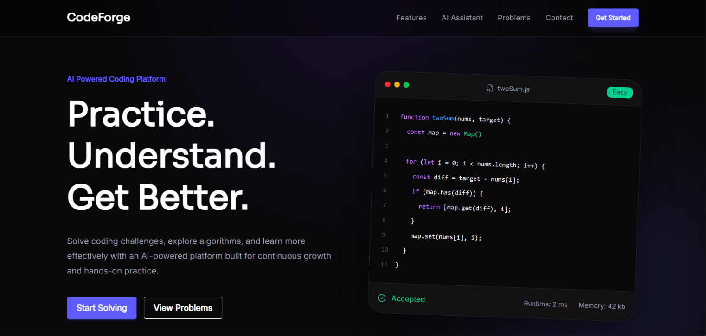
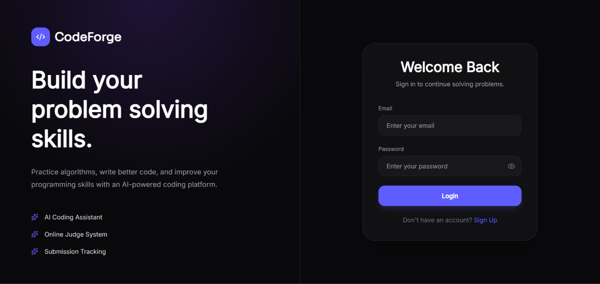
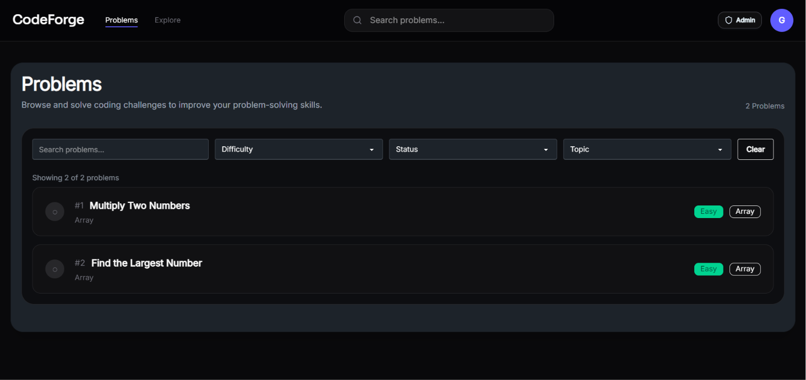
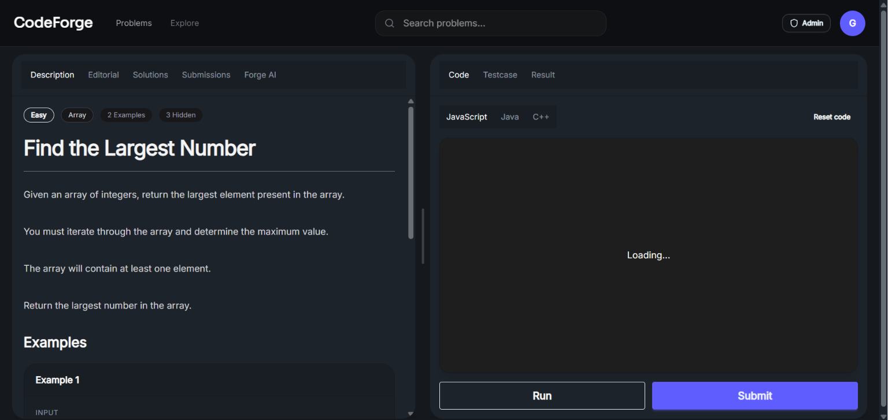
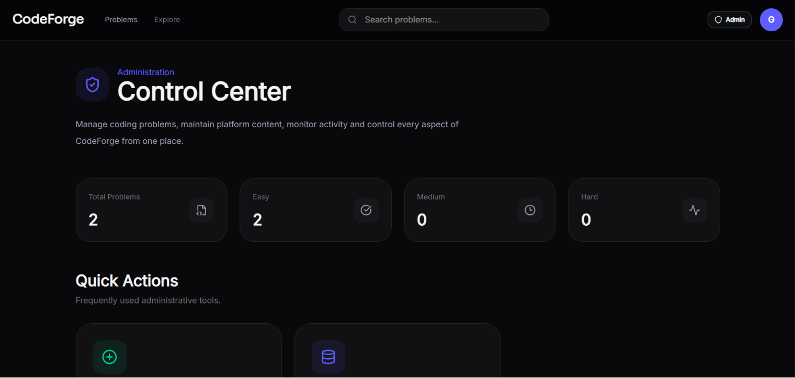
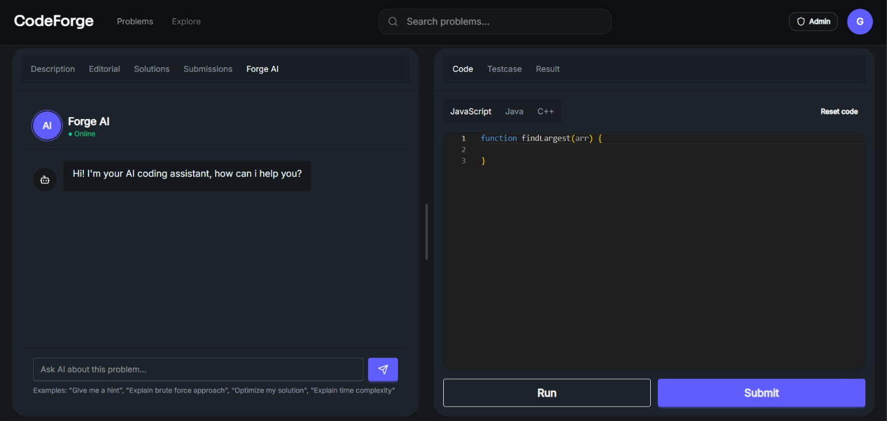

# CodeForge

CodeForge is an AI-powered coding platform designed for practicing data structures and algorithms, solving curated problems, writing and testing code in an online editor, tracking submissions, and getting problem-focused AI assistance. The application is built with a modern React frontend, a Node.js/Express backend, MongoDB for persistence, Redis for session/token handling, and Monaco Editor for the code workspace.

## Live Demo

Link: https://codeforge-app.vercel.app

## Project Status

CodeForge is under active development. The core flows are implemented, including:

- Authentication
- Problem browsing and filtering
- Problem workspace with editor, test cases, and results
- Problem creation, update, and management tools for admins
- AI assistant for problem-related help

Some product areas are still evolving, including profile management enhancements, richer analytics, and additional workspace polish.

## Screenshots

### Landing Page



### Login Page



### Problems Page



### Problem Workspace



### Admin Dashboard



### AI Assistant



## Features

### Authentication
- User registration
- User login
- Cookie-based session handling
- Auth check on app startup
- Route protection for authenticated areas
- Admin-only route protection for admin tools

### Problem browsing
- Clean problems listing page
- Search and filtering by difficulty, topic, and status
- Solved/unsolved state handling
- Problem cards/list presentation with modern dark UI

### Problem workspace
- Split layout with problem statement on the left and code editor on the right
- Monaco Editor integration
- Language switching support
- Run and submit actions
- Visible test case display
- Submission result display
- Submission history
- AI assistant tab for problem-specific help
- Responsive and resizable panel layout

### Admin tools
- Admin dashboard
- Create problem flow
- Update problem flow
- Delete problem flow
- Problem list management

### AI assistant
- Problem-focused AI chat experience
- Context-aware prompts using the active problem
- Concise explanations with selective code generation where relevant
- Designed to answer only coding/DSA-related questions

## Tech Stack

### Frontend
- React
- React Router
- Redux Toolkit
- React Hook Form
- Zod
- Monaco Editor
- Tailwind CSS
- DaisyUI
- Framer Motion
- Lucide React
- react-resizable-panels
- react-syntax-highlighter (used for code presentation where needed)

### Backend
- Node.js
- Express
- MongoDB / Mongoose
- Redis
- JWT authentication
- Cookie-based auth
- AI integration via external API

## Repository Structure

This project is organized into frontend and backend applications.

```text
codeforge/
├── frontend/
│   ├── src/
│   │   ├── components/
│   │   ├── pages/
│   │   ├── utils/
│   │   ├── authSlice.js
│   │   └── main.jsx
│   └── package.json
├── backend/
│   ├── src/
│   │   ├── config/
│   │   ├── controller/
│   │   ├── middleware/
│   │   ├── models/
│   │   ├── routes/
│   │   └── index.js
│   └── package.json
└── README.md
```

## Prerequisites

Before running the project locally, make sure you have:

- Node.js 18+ recommended
- npm or pnpm
- MongoDB instance
- Redis instance
- An AI API key for the assistant feature

## Installation

### 1. Clone the repository

```bash
git clone https://github.com/gauravGunjal14/CodeForge.git
cd CodeForge
```

### 2. Install backend dependencies

```bash
cd backend
npm install
```

### 3. Install frontend dependencies

```bash
cd ../frontend
npm install
```

## Environment Variables

Create a `.env` file in the backend and configure the required variables.

### Backend `.env`

```env
PORT=3000
MONGO_URI=your_mongodb_connection_string
JWT_KEY=your_jwt_secret
GEMINI_KEY=your_ai_api_key
```

If your Redis configuration uses host/port/password values, add the relevant Redis variables as required by your backend config file.

### Frontend environment

If you use a separate frontend environment file, configure the API base URL there or inside your Axios client.

Example:

```env
VITE_API_BASE_URL=http://localhost:3000
```

If your current Axios client uses a hardcoded backend URL, you can keep that during local development and later move it to an environment variable for deployment.

## Running Locally

### Start the backend

From the `backend` folder:

```bash
npm run dev
```

If your backend uses `nodemon`, this should start the Express server in development mode.

### Start the frontend

From the `frontend` folder:

```bash
npm run dev
```

The frontend will usually run on:

```text
http://localhost:5173
```

and the backend on:

```text
http://localhost:3000
```

## Available Scripts

### Frontend
- `npm run dev` — start the Vite development server

### Backend
- `npm run dev` — start the backend server in development mode

## Main User Flows

### Guest user
- Opens the landing page
- Signs up or logs in
- Lands on the problems page after authentication

### Authenticated user
- Browses the problem list
- Opens a problem workspace
- Reads the description
- Writes code in Monaco Editor
- Runs code against visible test cases
- Submits solutions
- Reviews submission history
- Uses the AI assistant tab for hints and problem-focused guidance

### Admin user
- Opens the admin dashboard
- Creates new problems
- Updates existing problems
- Deletes problems
- Manages problem content and solutions

## Current Product Areas

### Landing page
A premium dark-themed landing experience that introduces CodeForge, highlights the AI assistant, showcases features, and directs users into the solving workflow.

### Problems page
A clean problem browsing experience with search, filters, solved state support, and a layout designed for quick entry into the problem workspace.

### Problem page
A split-screen workspace built for focused coding practice:
- Problem statement on the left
- Editor and execution tools on the right
- Tabs for description, editorial, solutions, submissions, and AI assistance

### Admin panel
A private workspace for maintaining problem content, managing edits, and handling platform content.

## Deployment

Frontend is deployed on Vercel.

Backend is deployed on Render.

Database is hosted on MongoDB Atlas.

Redis is hosted on Redis Cloud.

## Roadmap

- [x] Authentication
- [x] Problem Workspace
- [x] Monaco Editor Integration
- [x] AI Assistant
- [x] Admin Dashboard
- [x] Submission History
- [ ] User Profiles
- [ ] Contest System
- [ ] Leaderboards
- [ ] Discussion Forum
- [ ] Company-wise Problem Sheets
- [ ] Editorial Videos
- [ ] Analytics Dashboard
- [ ] Dark/Light Theme Switching

## Contributing

Contributions, issues, and feature requests are welcome.

1. Fork the repository.
2. Create a new branch.
3. Commit your changes.
4. Push to your branch.
5. Open a Pull Request.

## Author

Gaurav Gunjal

GitHub:
https://github.com/gauravGunjal14

LinkedIn:
www.linkedin.com/in/gaurav-gunjal14

## License

Not specified.
